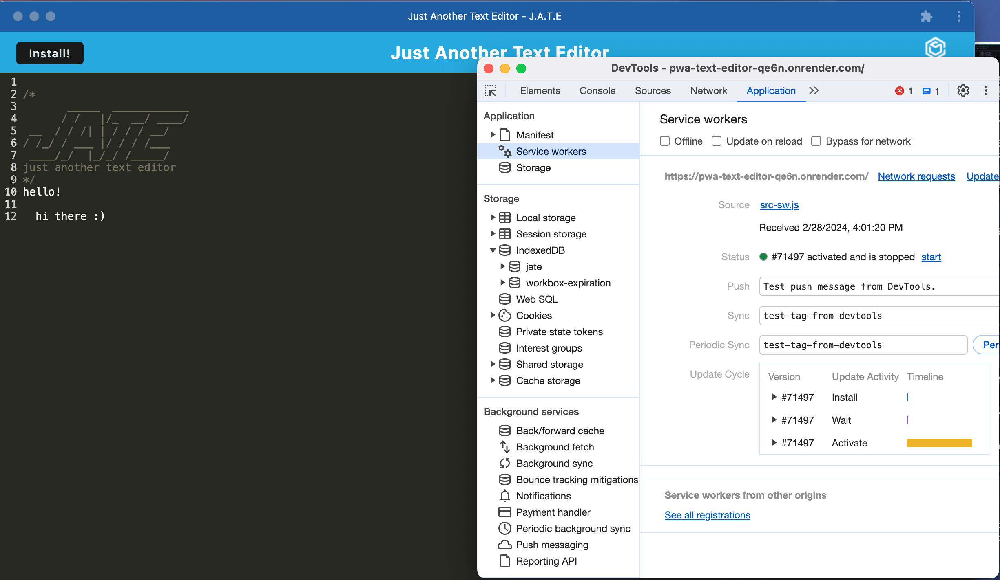

# PWA-Text-Editor-

## Description 
The motivation behind this project was to create a JATE text editor application using webpack where users can write text both online and offline. We created this application because it allows us to use both the front end and backend to successfully create an application that is easy to navigate and utilize with PWA. It solves the problem of being able to utilize a database efficiently to create text and persist that data, even if you are offline. I learned a lot about using the IndexedDB database to store relevant data into the database, using npm run build to build the application, and using babel and CSS loaders. 

## Installation 
After adding all the appropriate code to your webpack, database, and install js files, you can run npm install to install all the dependencies that need you need. This will install babel, etc. Then run: npm run start:dev to start the application

## Usage
Link to application on Render: https://pwa-text-editor-qe6n.onrender.com/

## Credits 
Tutoring session with Meg was a source of guidance in this assignment :)

## License 
Please refer to the license in the REPO 